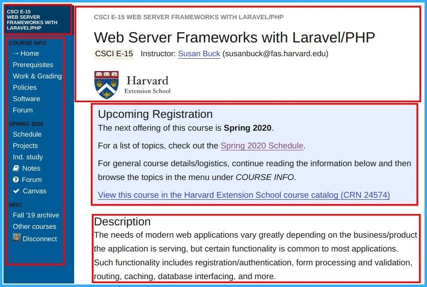
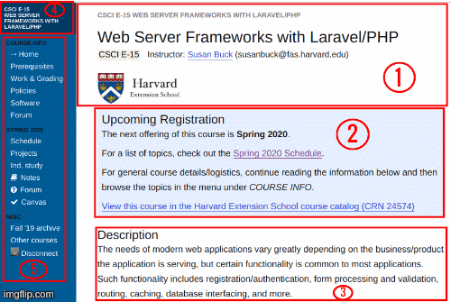
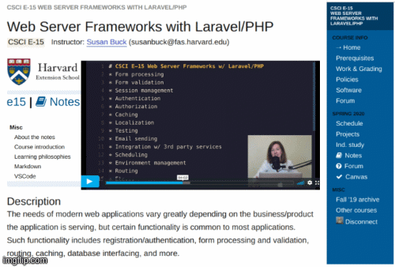

# CSS Layout Methodologies for Responsive eLearning Design
+ By: *Robelyn Garcia, PhD*


+ As Harvard University and a myriad of other brick-and-mortar universities move classes online amid the coronavirus pandemic, eLearning is at the forefront of post-secondary education. 

+ During the past year at Harvard University Extension School, I have encountered many Cascading Style Sheets (CSS) methodologies for laying out web pages and online eLearning course sites, including floats, tables, positioning, inline-block, CSS columns, Flexbox, and CSS Grid.  The purpose of this set of notes is to select three of these CSS methodologies and then compare and contrast each of these CSS methods.  I will also present an examination, analysis and reflection of why one of the methodologies is the best selection for responsive design and responsive eLearning design.

## Separation of Concerns for CSS Methodologies
+ Before selecting a CSS methodology for your eLearning website, you need to know how to follow Separation of Concerns.  “In computer science, Separation of Concerns (SoC) refers to the practice of breaking a program into distinct sections, each with their own concern/responsibility. Benefits: *Provides a logical organizational structure. *Easier to maintain/More flexible for collaboration amongst a team of developers. *Makes aspects of the program modular and thus reusable. Example SoC: HTML & CSS” (Buck, 2020).  Whichever CSS methodology you ultimately decide to use, it is highly recommended to utilize SoC.

# Floats, Flexbox and CSS Grid for Online Courses
+ I have selected floats, Flexbox and CSS Grid for comparison and critical review.  In order to understand these and any CSS layout methodologies, online course designers, new web designers, programmers and engineers alike must of course understand both the new border box model and the old content box model.
+ When writing and reading float, Flexbox and CSS Grid code, it is imperative to remember that every element in your web browser or eLearning course webpage has a box surrounding it.
+ **Example of E-15 Course Box Model Elements Below:**


 ```Notice each element has a box around it. For example the Header, the Menu and the Description.```

## Floats
+ I will start with one of the oldest CSS methodologies, which is float-based grid systems, the website design and mobile front-end design industry's standard (Kramer, 2020).
+ Floats are a CSS positioning property that is often used for wrapping text around images.  Wrapping text is one of the positive characteristics of a float layout, in addition to floating elements remaining a part of the regular flow of an eLearning course website or web page.
+ While floats are still being used for a lot of layout, there are much stronger tools in modern web design for creating layout on web pages.  Specifically, I refer to CSS Grid (aka ‘grid’) and Flexbox (Coyier, 2019).

## Flexbox
+ Flexbox provides a more effective way to code the layout and distribute space among elements in a container, even when their size is constantly changing.  Flexbox's remarkable alignment and ordering features can “juice up our grid, taking us places that simply weren't possible with floats” (Kramer, 2018).  
+ A big advantage of Flexbox besides its CSS aligning features is that it is supported in all modern browsers and most mobile platforms.  This is of import for eLearning because many online students often switch in between devices.
+ As a brand new full-stack web developer, I have found Flexbox easy to code for parts of my webpages.  However, it is not as fault tolerant as CSS Grid when trying to code an entire course site page.

## CSS Grid
+ CSS Grid is the most robust layout system in web design.  A course website author can iterate code to align and nest multiple web page elements into columns and rows.  CSS Grid is the newest layout spec available in the latest browsers (Kramer, 2020).
+ Further, CSS Grid can divide a page into main sections and define the relationship of HTML primitives by size, position, and even layer.
+ The only disadvantage I have found for CSS Grid is older browser compatibility issues.  However, “when used with care for simple cases, Grid can gracefully fall back to older layout techniques” (Williams, 2018).
+ Learn more about CSS Grid and other CSS Methodologies. Get 6 months of an Educative and or Frontend Masters membership **FREE** by enrolling in the GitHub Student Developer Pack at <https://education.github.com/students>.
+ **Example of CSS Grid Dynamic Elements Below:**


```Dynamic Elements: 1-Header, 2-Article Aside One, 3-Article Aside Two, 4-Aside One, 5-Aside Two```

## Utilization and Combination of Appropriate CSS Layout Methodologies
+ When coding responsive layouts there are strengths and weaknesses of float-based layout, Flexbox layout, and CSS Grid layout.  The key is to find when is it appropriate to use each methodology and or a combination of methodologies.
+ When building an eLearning course webpage with a one-dimensional layout, Flexbox is the obvious choice because of cross browser compatibility and support.
+ However, when a two-dimensional responsive layout is required or preferred, CSS Grid will code both columns and rows in dynamic fashion and success.
+ When a web page combines both a one-dimensional and a two-dimensional responsive layout then combining these two methodologies is suggested.  Flexbox and CSS Grid integrate quite well together; online course designers and web designers are already taking advantage of the strengths of combining these methodologies in responsive design and responsive eLearning design.
+ To learn more about Utilization and Combination of Appropriate CSS Methodologies visit CSS Grid and Flexbox for Responsive Web Design <https://frontendmasters.com/courses/css-grids-flexbox>.

## The Best Methodology
+ Across platforms, CSS Grid is the best (excelling all others) CSS methodology for laying out web pages and HTML elements.  As aforementioned, when a two-dimensional responsive layout is required or preferred, CSS Grid will code both columns and rows in dynamic fashion and success.  
+ As the best and most powerful methodology, CSS Grid is a monumental leap forward from the float hacks and table hacks which were once the only layouts available to front end web designers.  CSS Grid can handle basic layouts and complex layout problems more consistently and semantically.  
+ This method makes it easier to design responsive web pages with the ability to define different size rows, columns, nesting, offsetting, layering and overlapping.  Although older and soon to be obsolete browsers do not support CSS Grid, it is able to function across multiple modern browsers, with fairly reasonable fallbacks (Kramer, 2020).
+ As an eLearning Professor and online Post-Doc Scholar, I recognize the importance of responsive design in eLearning.  A course site’s ability to adapt elements seamlessly across devices is referred to as responsive eLearning design.
+ Developing a responsive eLearning design university course is a decision by college course web designers and professors to create a more engaging educational interaction.  “Responsive eLearning designs draw their inspiration from the responsive website designs” (Pandey, 2018). CSS Grid can handle the basic course functions as well as video replay and multiple webinar  functionality needed for 2020's increased online course demand.
+ Just as CSS Grid is the best methodology available for responsive websites, the same is true for responsive eLearning platforms.  CSS Grid gives course designers and Professors the ability to provide optimal viewing across a myriad of devices for a higher impact online eLearning experience.

## Screenshot Examples of an Online Class utilizing CSS Grid
+ CSS Grid Dynamic eLearning Responsive Design Course Format


```CSS Grid enables course designers the ability to move page elements with ease.```

+ Personalized CSS Grid eLearning Responsive Design Course Layout


```CSS Grid enables course designers and Professors the ability to personalize their online course.```

## Practice
+ Practice CSS Grid for your own Course at: <https://codepen.io/DrRobelynGarcia/pen/gOpBzbJ>.

## Resources
+ A Complete Guide to Grid: <https://css-tricks.com/snippets/css/complete-guide-grid>
+ Free CSS Bootcamp: <https://frontendmasters.com/bootcamp/introduction-css>
+ CSS Grid Layout Module <https://www.w3schools.com/css/css_grid.asp>
+ Official course notes for Web Server Frameworks with Laravel/PHP: <https://hesweb.dev/e15>.
+ Harvard Extension School related Courses: <https://www.extension.harvard.edu/course-catalog/courses?subjects=Computer%20Science%2BDigital%20Media>.
+ This note set Production URL: <https://github.com/RGPhD/e15/blob/master/independent-study/README.md>

## References
+ Buck, S. (2020). Separation of Concerns.  Retrieved from 
https://hesweb.dev/e15/notes/php/separation-of-concerns
+ Coyier, C. (2019). All About Floats.  CSS Tricks.  Retrieved from 
https://css-tricks.com/all-about-floats
+ Kramer, J. (2018).  CSS Grid and Flexbox in Responsive Web Design Abstract. 
Retrieved from https://scholar.harvard.edu/jen4web/publications
/css-grid-and-flexbox-responsive-web-design
+ Kramer, J. (2020).  Responsive Layout 2.0.  Linkedin Learning: Harvard.  Retrieved 
from https://www.linkedin.com/learning/responsive-layout-2-0
/the-evolution-of-responsive-design
+ Mozilla Developer Network (MDN) contributors. (2020). CSS Grid Layout. Retrieved from 
https://developer.mozilla.org/en-US/docs/Web/CSS/CSS_Grid_Layout
+ Pandey, A.  (2018).  Responsive eLearning Design for Higher Engagement And A
 	Better Learning Experience.  eLearning Industry.  Retrieved from 
https://elearningindustry.com/responsive-elearning-design-higher-engagement-
learning-experience-7-examples
+ Williams, O. (2018).  The Slow Death of Internet Explorer and the Future of Progressive 
Enhancement.  Retrieved from https://alistapart.com/article/the-slow-death-of
-internet-explorer-and-future-of-progressive-enhancement


### Learning to code is much like learning to play a sport! 
__*"To really get good, it takes an understanding of the fundamentals, lots and lots of hands-on practice, and the ability to learn from others"*__ Harvard Digital Media Professor [Larry Bouthillier](https://www.extension.harvard.edu/faculty-directory/laurence-p-bouthillier).